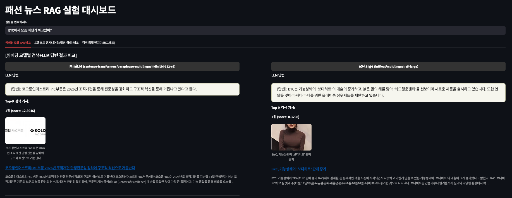
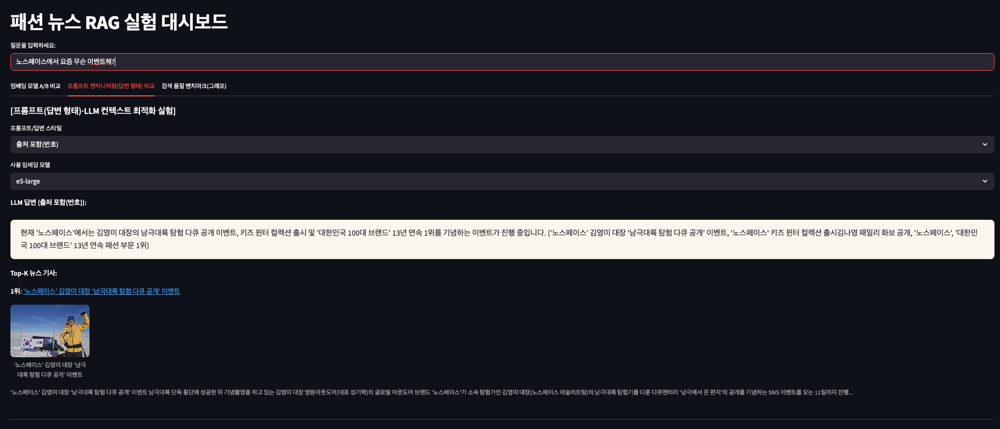
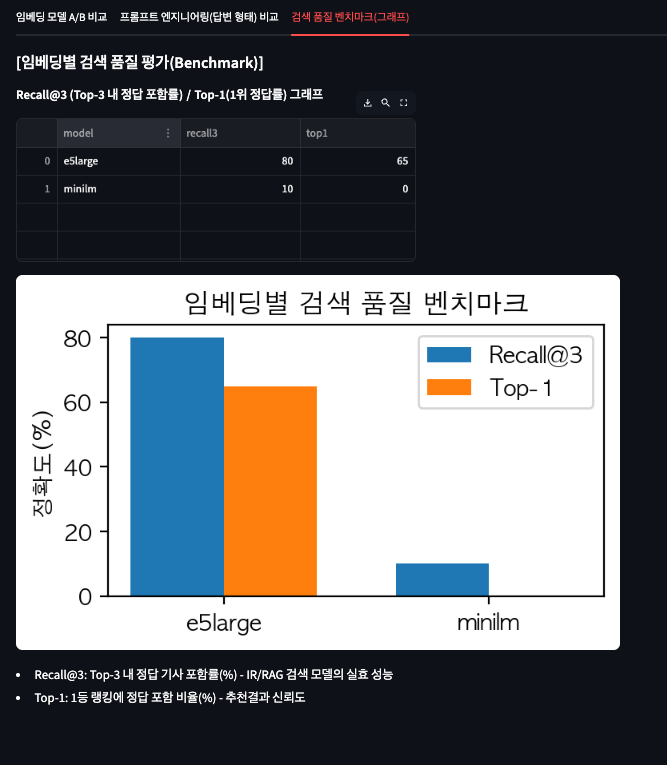

# 패션 도메인 RAG 검색·분석 PoC

**이 프로젝트는**  
패션 뉴스 데이터 기반 LangChain RAG 파이프라인을 직접 구축·실험·벤치마크하는 End-to-End PoC(Proof of Concept)입니다.  
뉴스 크롤링 → 전처리 → 임베딩/인덱스 → Streamlit 대시보드(검색, LLM 답변, 프롬프트 엔지니어링) → 품질벤치마크까지  
모든 과정을 코드/노트/그래프와 함께 제공합니다.

---

## 🚩 주요 기능

- **패션 도메인 자체 데이터 크롤링 및 정제**
- **임베딩 모델별(A/B) 벡터 인덱스 구축 및 유사도 검색**
- **Streamlit 기반 대시보드:**  
    - 임베딩 A/B 결과·답변 비교  
    - 프롬프트 스타일(요약/출처/리스트/장문 등) 선택  
    - 기사 카드에 이미지(썸네일) 포함  
    - 검색 품질(Recall@3, Top-1) 벤치마크 시각화
- **검색 품질 자동 벤치마크(골든셋·통계·그래프)**
- **폴더/모듈별 완전 모듈화(확장·테스트·실무형 유지보수 용이)**

---
## 🛠️ 기술 스택 (Tech Stack)

- **Python 3.11**
- **LangChain** (RAG 파이프라인)
- **OpenAI GPT (LLM 연동)**
- **HuggingFace Sentence Transformers** (임베딩 벡터)
- **FAISS** (벡터DB)
- **Streamlit** (웹 대시보드 구축)
- **Pandas, Matplotlib** (데이터 처리 및 벤치마크 그래프)
- **Requests, BeautifulSoup** (패션 뉴스 크롤링)
---


## 🗂️ 폴더 구조

```text
├── app.py                 # Streamlit 대시보드 실행 파일
├── data/
│   ├── raw/               # 크롤링 원본 데이터
│   ├── processed/         # 전처리 데이터, FAISS Index
│   └── ab_metrics/        # 벤치마크 및 골든셋 csv
├── src/
│   ├── crawling/          # 크롤러 (데이터 수집)
│   ├── embedding/         # 임베딩/인덱싱/모델 설정
│   ├── eval/              # 평가/통계/리포트
│   ├── preprocessing/     # 데이터 전처리/인제스트
│   ├── prompts/           # 프롬프트 템플릿/옵션
│   └── search/            # 검색/FAISS/LLM Chain
├── requirements.txt
└── README.md
```
## ▶️ 간단 사용법
1. Conda 가상환경 생성 및 활성화
```
conda create -n myenv python=3.11
conda activate myenv
```
2. 필요 패키지 설치
```
pip install -r requirements.txt
```
3. 환경 변수 설정

- 예제 파일을 복사해 .env 파일을 생성합니다.

```bash
cp .env.example .env
```
- .env 파일에 OpenAI API 키를 입력합니다.
```
OPENAI_API_KEY=sk-xxxxxxxxxxxxxxxxxxxxxxxxxxxxxx
```
4. [Optional] 데이터 수집/전처리/임베딩 (최초 1회)
```
python -m src.crawling.crawl_fashion_news
python -m src.preprocessing.preprocess
python -m src.embedding.embed
```
(필요시 src/embedding/embedding_configs.py에서 모델/경로 추가)

5. Streamlit 대시보드 실행
```
streamlit run app.py
```
6. [벤치마크 실험 자동평가]
```
python -m src.eval.ab_benchmarker
```
결과는 data/ab_metrics/ab_benchmark_result.csv로 저장됨

## 💻 대시보드/실행 예시

- 질문 입력 → 각 임베딩 모델별 유사 기사/답변/이미지·점수 동시 비교
- 프롬프트 스타일별(요약/출처/리스트/장문 등) LLM 답변 품질 비교
- 실험용 벤치마크 탭에서 Recall@3, Top-1 그래프/표 확인
#



## 📊 벤치마크 지표(예시)

최신 임베딩(e5-large)은 minilm 대비 패션 키워드 기준 6~8배 높은 품질을 보임

## 🧩 폴더별/주요파일 역할 요약
- app.py : 대시보드 및 실험 컨트롤 메인 진입점
- src/crawling/ : 각종 웹/뉴스 크롤링 스크립트
- src/preprocessing/ : 데이터 클렌징, 증강, 인제스트
- src/embedding/ : 임베딩 모델 관리, 벡터 인덱스 생성
- src/prompts/ : 다양한 프롬프트관리 및 옵션
- src/search/ : 벡터서치 체인, LLM 연결 등
- src/eval/ : 벤치마크, 코드, 그래프, 평가 통계

## 🔑 데이터 출처/저작권 안내
- 본 프로젝트 데이터는 kfashionnews.com에서 크롤링한 뉴스 기사/리소스를 가공해 사용하였습니다.
- 데이터/코드는 연구·비상업적 목적(PoC, 포트폴리오)으로만 활용되며 저작권은 원저작자(케이패션뉴스)에 있습니다.

## 🔧 개발자 정보

**개발자**: Choi Bo Gyeong

**프로젝트 기간**: 2026.01

**핵심 구현 기술**
- LangChain 기반 RAG(Retrieval-Augmented Generation) 파이프라인 설계 및 구현
- FAISS 벡터DB 기반 패션뉴스 검색 시스템
- HuggingFace Sentence-Transformers 임베딩 활용
- OpenAI API 연동 및 프롬프트 엔지니어링 실험
- Streamlit 기반 실시간 A/B 실험 대시보드 개발
- Python 기반 데이터 파이프라인(스크래핑, 전처리, 자동화)
- 검사셋 기반 자동 품질 평가(Recall@3, Top-1 등 벤치마크 그래프화)

**Contact**
- 📧 Email: cbg1704@gmail.com


**Tech Stack**  
`Python` `Streamlit` `FAISS` `LangChain` `sentence-transformers` `OpenAI API` `pandas` `matplotlib`
